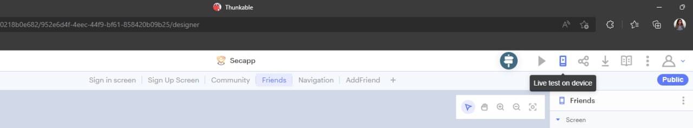
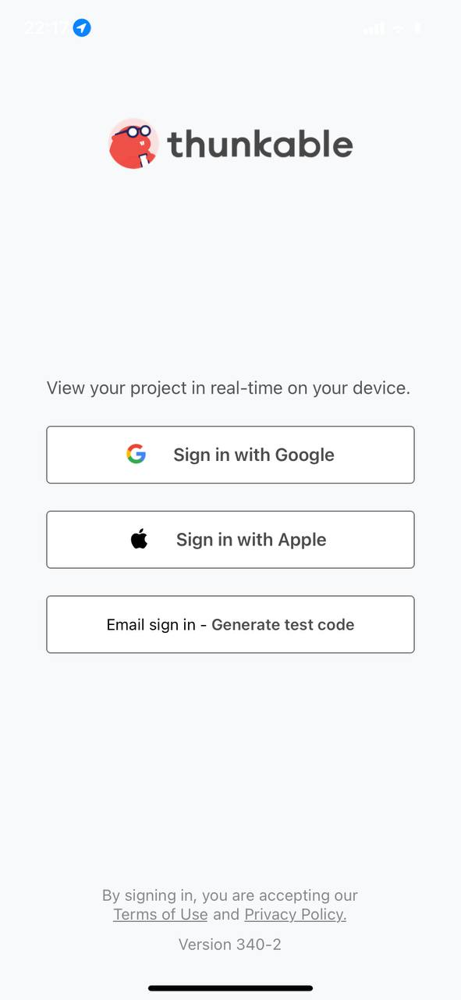
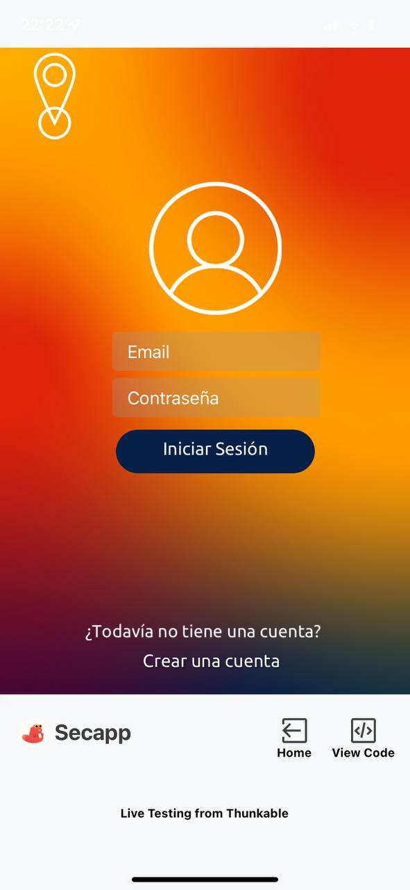
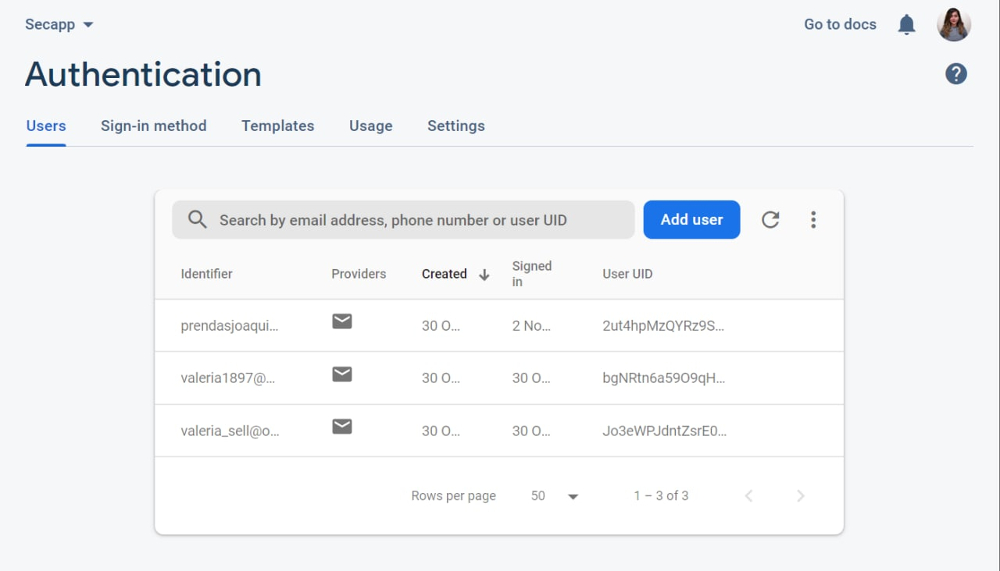
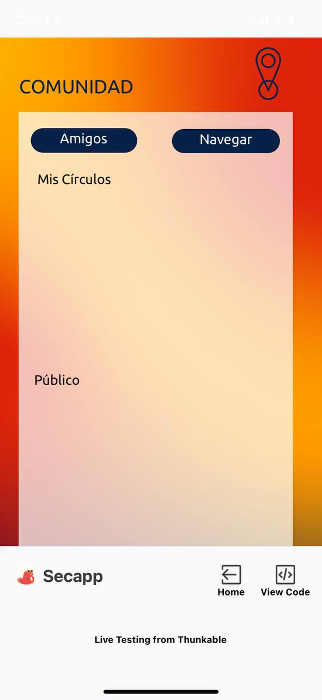
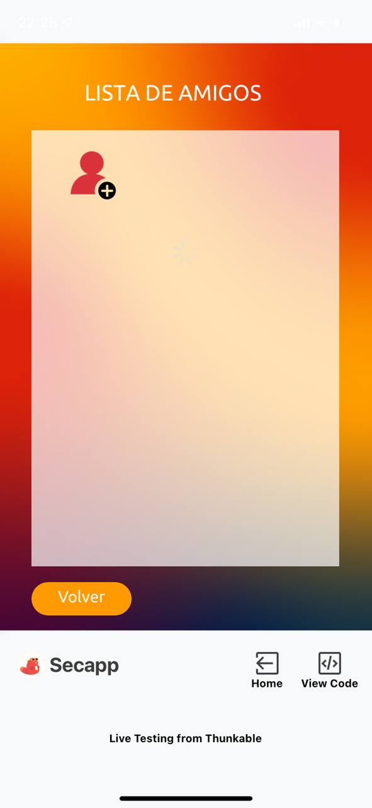
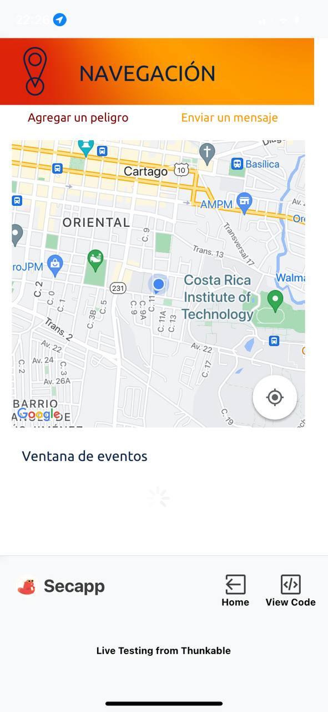

**Documentación de la Tarea Corta 2**

*Instalación*  
El primer paso en la instalación del ambiente y las herramientes correspondientes se da por medio de la instalación de las siguientes librerías:
1. pip install pyrebase4
2. pip install Flasks
3. pip install flask_restful
4. pip install firebase_admin

Se debe crear una cuenta en Thunkable (herramienta utilizada para la creación de la aplicación móvil) y entrar al siguiente enlace:
https://x.thunkable.com/copy/9fdd4eb4ee9ddaa72af961dd9be4f4c7
Este corresponde a la aplicación desarrollada.

Seguidamente, se debe crear una cuenta en Firebase (herramienta utilizada para la base de datos) y entrar al siguiente enlace:
https://secapp-bdii-default-rtdb.firebaseio.com/
Este corresponde a la base de datos en tiempo real de firebase. 

Finalmente, para probar y utilizar la aplicación se recomienda instalar Thunkable Live Test en el celular.

*Prueba de la aplicación*  
En la página web de Thunkable, se debe seleccionar la opción de "Live test on device".

Una vez seleccionado, se abrirá una ventana de diálogo para ingresar un código.

En la aplicación móvil se deberá seleccionar la tercera opción, 

Ahí aparecerá el código que se debe ingresar en la página web. 

Ya en la aplicación móvil, se verá la pantalla de login 

Se deberá ingresar con una cuenta existente en la base de datos, encontrados en la sección de autenticación. 

pagina de comunidad

si se selecciona la opción de amigos

si se selecciona la opción de navegación
.jpg)

al darle click al boton de mi ubicacion

