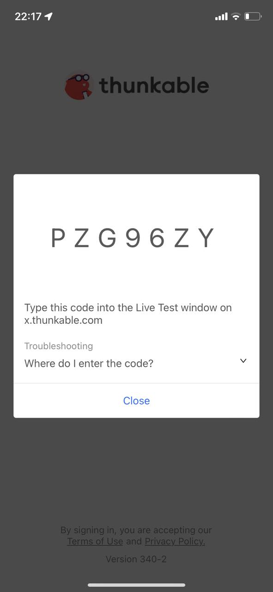

# **Documentación de la Tarea Corta 2**

## *Instalación*  
El primer paso en la instalación del ambiente y las herramientes correspondientes se da por medio de la instalación de las siguientes librerías:
1. pip install pyrebase4
2. pip install Flasks
3. pip install flask_restful
4. pip install firebase_admin

Se debe crear una cuenta en Thunkable (herramienta utilizada para la creación de la aplicación móvil) y entrar al siguiente enlace:
https://x.thunkable.com/copy/9fdd4eb4ee9ddaa72af961dd9be4f4c7
Este corresponde a la aplicación desarrollada.

Seguidamente, se debe crear una cuenta en Firebase (herramienta utilizada para la base de datos) y entrar al siguiente enlace:
https://secapp-bdii-default-rtdb.firebaseio.com/
Este corresponde a la base de datos en tiempo real de firebase. 

Finalmente, para probar y utilizar la aplicación se recomienda instalar Thunkable Live Test en el celular.

 

## *Prueba de la aplicación*  
En la página web de Thunkable, se debe seleccionar la opción de "Live test on device".

Una vez seleccionado, se abrirá una ventana de diálogo para ingresar un código.

En la aplicación móvil se deberá seleccionar la tercera opción, 

Ahí aparecerá el código que se debe ingresar en la página web. 

Ya en la aplicación móvil, se verá la pantalla de login. 

Se deberá ingresar con una cuenta existente en la base de datos, encontrados en la sección de autenticación. 

Página de comunidad.

Si se selecciona la opción de amigos.

Si se selecciona la opción de navegación.

.jpg)

Al darle click al boton de mi ubicación.

 

## *Pruebas Unitarias*  
### Log In y Sign Up

Se debe seleccionar la opción de crear una cuenta.

Se ingresa la información, si las contraseñas no son idénticas retorna un mensaje de error. Se deberán ingresar nuevamente.

Se deberá validar el correo antes de ingresar, de lo contrario no se permitirá el acceso.

Ejemplo del correo de verificación:

Este suele llegar directo a la carpeta de spam.

Prueba de que la cuenta fue creada y verificada con éxito.

 

### Conexión de Python y Firebase

Para probar la conexión de Python con la base de datos en tiempo real de Firebase, se creó un json de prueba con datos relevantes los cuales fueron publicados mediante las funcionalidades de la librería pyrebase.

Como es posible ver, dichos datos fueron publicados con éxito.

 

## *Conclusiones y recomendaciones*  

- La utilización de herramientas y tecnologías como Thunkable facilitan la creación y desarollo de aplicaciones móviles de gran manera.  Esto debido a que presenta componentes para una cantidad bastante diversa de funcionalidades posibles de una aplicación.  Todo sin necesidad de escribir o desarrollar código.  Se recomienda la exploración de esta herramienta para desarrollos futuros.
- Firebase es una herramienta que en este caso fue utilizada como base de datos en tiempo real.  Su curva de aprendizaje puede ser mayor a la de Thunkable pero una vez dominada, es sumamente sencillo la integración con otras tecnologías como Python.