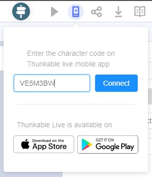

**Doumentación de la Tarea Corta 2**

*Instalación*
Se deberán instalar las siguientes librerías 
1. pip install pyrebase4
2. pip install Flasks
3. pip install flask_restful
4. pip install firebase_admin

Se debe crear una cuenta en Thunkable y entrar al siguiente enlace:
https://x.thunkable.com/copy/9fdd4eb4ee9ddaa72af961dd9be4f4c7
Este corresponde a la aplicación. 

Seguidamente, se debe crear una cuenta en Firebase y entrar al siguiente enlace:
https://secapp-bdii-default-rtdb.firebaseio.com/
Este corresponde a la base de datos en tiempo real de firebase. 

Finalmente, para probar la aplicación se recomienda instalar Thunkable Live Test en el celular.

*Para probar la aplicación*
En la página web de Thunkable, se debe seleccionar la opción de "Live test on device".

Una vez seleccionado, se abrirá una ventana de diálogo para ingresar un código.

En la aplicación móvil se deberá seleccionar la tercera opción, 

Ahí aparecerá el código que se debe ingresar en la página web. 
 